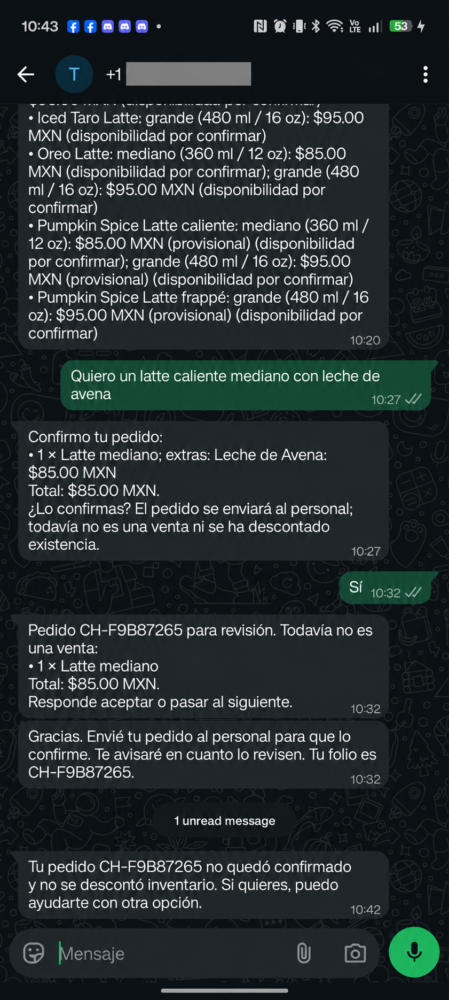
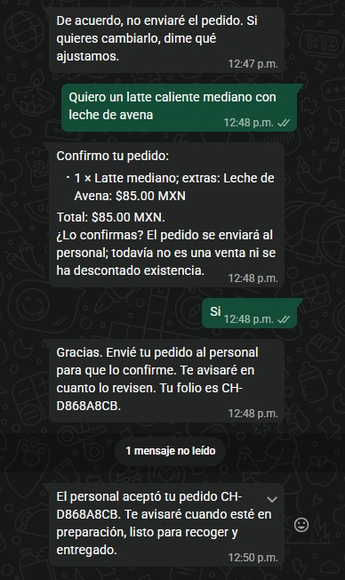
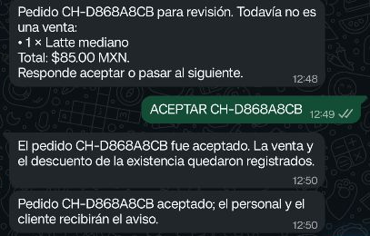
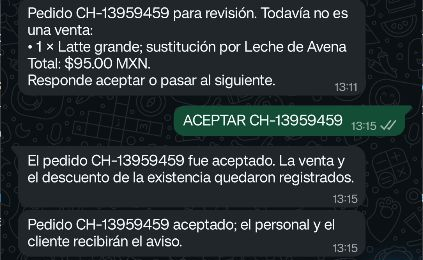
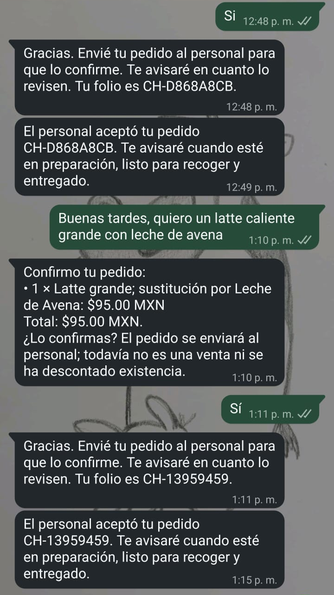
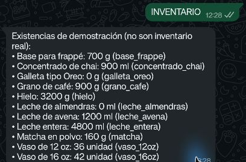

# Integración sintética final — 9 de octubre de 2026

## Entorno comprobado

- Backend Hackathon 2 en VPS Debian 12, detrás de la ruta HTTPS exclusiva del proyecto y escuchando en loopback.
- Qwen3Guard `Qwen/Qwen3Guard-Gen-0.6B` en la torre Debian 13, snapshot `fada3b2f655b89601929198343c94cd2f64d93cc`, conectado al VPS por un túnel SSH restringido a direcciones de loopback.
- Groq configurado para la demostración. La cuenta y el número de WhatsApp de Meta son de prueba; la app Mozart está suscrita a `messages` y su callback corresponde a Hackathon 2.
- Se usó una base SQLite temporal y datos sintéticos. No se contactó la API de WhatsApp ni se envió ningún mensaje durante esta batería.

## Recorridos y resultado

| Caso | Resultado | Tiempo observado |
| --- | --- | ---: |
| Pregunta por latte | Aclaración ante modalidad no especificada | 21.948 s |
| Consulta coloquial con erratas sobre Oreo | Pidió aclaración | 14.122 s |
| Latte caliente con leche de avena | Respondió con existencia y total | 14.600 s |
| Pregunta por horario no confirmado | Reconoció que falta información | 13.907 s |
| Intento de inyección de instrucciones | Pausó el flujo | 5.862 s |

Resultado: **5/5 casos pasaron**. La mediana fue 14.122 segundos y el rango, 5.862–21.948 segundos. Son cinco observaciones sintéticas de desarrollo; no prometen rendimiento para tráfico real.

## Otras comprobaciones

- Qwen3Guard local respondió `Safe` a una consulta normal y `Controversial` a un intento sintético de inyección.
- El servicio H2 recibió una clasificación a través del túnel privado y se pausó con seguridad si la guardia no podía validar.
- Meta confirmó la app Mozart, el campo `messages` y la callback dedicada de H2.
- Suite H2+T1: **111 aprobadas, 2 omitidas** por requerir Tesseract.
- Hackathon 1 mantuvo su ruta y respondió HTTP 200 durante la revisión del VPS.

## Preflight de Meta y alcance de esta evidencia

Durante el preflight se resolvieron el token vencido y la diferencia entre el identificador mexicano `521...` recibido por webhook y el formato `52...` permitido por Meta. La normalización quedó desplegada; la callback pública y los mensajes se comprobaron. La consulta del menú funcionó y el primer pedido **CH-F9B87265** expiró tras 10 minutos, sin aceptación ni descuento de inventario. Los intentos y su cronología se detallan más abajo. Solo se usaron teléfonos y datos de prueba.

OCR está apagado en el VPS. La prueba sintética no cubre reconocimiento de fotos ni acredita el ciclo real de mensajes entrantes y salientes. No es una validación de producción.

## Intento manual desde el teléfono

El 9 de octubre se conectó un Android de prueba y se abrió el chat del número de prueba de Meta. La primera consulta llegó al webhook y el trabajo del asistente terminó, pero Meta rechazó la respuesta con HTTP 401; la comprobación privada devolvió error 190/subcódigo 463. El token se renovó después y las consultas Graph confirmaron el recurso telefónico y el permiso `whatsapp_business_messaging`. Dos consultas posteriores llegaron al webhook y se completaron, pero Meta rechazó las respuestas con HTTP 400/código `131030`. No se recibió respuesta del asistente, no se creó ningún pedido ni se afectó el inventario. La lista «A» ya mostraba el destinatario permitido. La revisión privada encontró una diferencia de formato: el webhook dio `521...` y la lista de Meta usa `52...`. Un envío directo de comprobación al formato de la lista fue aceptado con HTTP 200 y sus estados posteriores confirmaron `sent`, `delivered` y `read`. H2 normalizó el identificador al entrar y el cambio se desplegó. No se incluye captura porque la pantalla contiene mensajes previos y elementos ajenos a la evidencia.

**Actualización posterior, 9 de octubre:** se envió desde Android la consulta «¿qué tipos de latte tienen?». El webhook la recibió, el asistente respondió con las opciones del menú y Meta confirmó que la respuesta fue enviada, entregada y leída. El cliente confirmó el pedido de demostración CH-F9B87265; el personal no lo aceptó dentro del plazo, por lo que expiró. El mensaje de expiración se entregó y no hubo movimiento de inventario.

## Pedido de prueba: expiró sin aceptación del personal

El 9 de octubre, el teléfono de prueba envió: «Quiero un latte caliente mediano con leche de avena». El agente respondió con un resumen de 1 Latte mediano, extra Leche de Avena y total de **$85.00 MXN**. El cliente contestó «Sí»; el sistema creó el pedido **CH-F9B87265** por $85.00 MXN y lo envió al administrador de respaldo.

La base confirmó que el pedido apunta a `hot_latte`, tamaño mediano, cantidad 1 y modificador `leche_avena`; el precio base es $70 y el extra $15. El aviso al administrador quedó leído, pero no llegó respuesta en los 10 minutos disponibles. A las 10:42, el sistema marcó el pedido y su ticket como `expired`, cerró la ronda con resultado `timed_out` y envió al cliente: «Tu pedido CH-F9B87265 no quedó confirmado y no se descontó inventario. Si quieres, puedo ayudarte con otra opción». Meta confirmó que ese aviso se entregó. No hay `accepted_at`, venta ni movimientos de inventario. El texto del resumen visible dice «Latte mediano» y no repite «caliente», aunque la variante guardada es `hot_latte`.

La respuesta automática a la consulta anterior sobre el menú también quedó registrada como `read` por Meta:

Ese primer pedido no cerró el ciclo porque el personal no lo aceptó. Se conservó como pedido expirado, sin venta ni movimiento.

## Primer pedido aceptado en vivo y hallazgo de sustitución

Más tarde, un tercer número permitido por Meta hizo un nuevo pedido de Latte mediano con leche de avena. El cliente confirmó el resumen de **$85.00 MXN**. El número autorizado de personal aceptó el folio **CH-D868A8CB** dentro del plazo. SQLite registra un pedido aceptado, una venta y cuatro movimientos únicos: café, leche entera, leche de avena y vaso. Los avisos de aceptación se enviaron al cliente y al personal.

La prueba detectó que el catálogo llamaba “extra” a la leche de avena: el aviso al personal no explicaba la opción y el registro descontó tanto leche entera como avena. No se revirtió ni reescribió esa operación aceptada. La evidencia del teléfono del personal se recortó para excluir el encabezado y los datos del contacto.

La captura del cliente muestra la confirmación de ese primer pedido y el texto anterior que describía la avena como extra. Se recortó el encabezado con el número de teléfono; esta imagen documenta el hallazgo que motivó la corrección:

## Corrección de la sustitución de leche de avena

El cliente aclaró que la avena debe sustituir a la leche entera. La versión **9cea3d3** cambia esa regla en el catálogo sintético, calcula la cantidad de avena según el tamaño, muestra la sustitución tanto al cliente como al personal y migra SQLite de la versión 4 a la 5. La migración se probó sobre una copia de la base del VPS; al desplegarla se verificó que las existencias no cambiaron, los pedidos anteriores se conservaron y no había pedidos pendientes. El servicio quedó activo.

## Segundo pedido aceptado en vivo tras la corrección

Con la versión **9cea3d3** activa, un tercer número de prueba inició un pedido de Latte grande con leche de avena. El resumen indicó claramente que la avena sustituía a la leche entera; el cliente confirmó el total de **$95.00 MXN** y el pedido **CH-13959459** quedó asignado al personal autorizado. El personal aceptó el folio desde el teléfono conectado a scrcpy.

La comprobación de SQLite confirmó el estado aceptado, una sola venta y exactamente tres movimientos únicos: **−20 g de café, −300 ml de leche de avena y −1 vaso de 16 oz**. La leche entera no tuvo movimiento. Las existencias de la prueba se compararon con la copia de resguardo tomada antes de desplegar el cambio, que ya incluía el pedido anterior; los deltas corresponden únicamente a esta segunda venta. Los avisos de aceptación para cliente y personal quedaron procesados por WhatsApp y marcados como leídos. El servicio permaneció activo.

La captura redactada del teléfono del personal conserva el resumen de sustitución, el folio, el total y la confirmación de aceptación; se recortó para quitar el encabezado del chat y la información del contacto:

La captura del teléfono del cliente confirma la solicitud, la sustitución por avena, el total, el folio y el aviso de aceptación. Se eliminó del recorte el encabezado con el número y la interfaz del teléfono:

## Validación móvil de acceso y consulta de existencias

El 9 de octubre de 2026, el usuario confirmó que ambos números de administración pudieron iniciar sesión. Desde un Android conectado mediante scrcpy, una sesión autorizada envió `INVENTARIO` al número de prueba de WhatsApp. H2 respondió con existencias de demostración e indicó expresamente que no representan inventario real. La consulta fue de solo lectura: no creó pedidos ni modificó existencias.

La captura se recortó para excluir el encabezado del chat, los números telefónicos y mensajes anteriores de acceso. Sirve como evidencia del comando y de la respuesta móvil; no acredita por separado las dos sesiones de administrador ni el ciclo de aceptación de una venta.

El ciclo de venta quedó comprobado con la regla actualizada: sustitución por tamaño, confirmación del cliente, aceptación de personal autorizado, una venta, descuentos idempotentes y avisos a ambas partes. Toda la existencia y las ventas siguen siendo datos sintéticos de la demostración; esto no acredita una venta con clientes reales.
