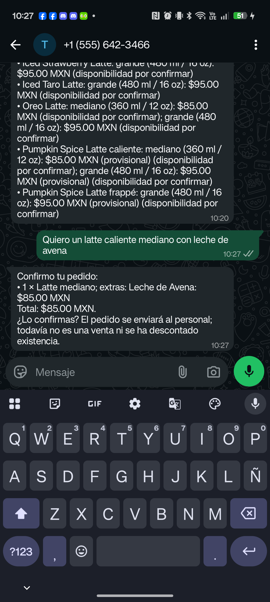
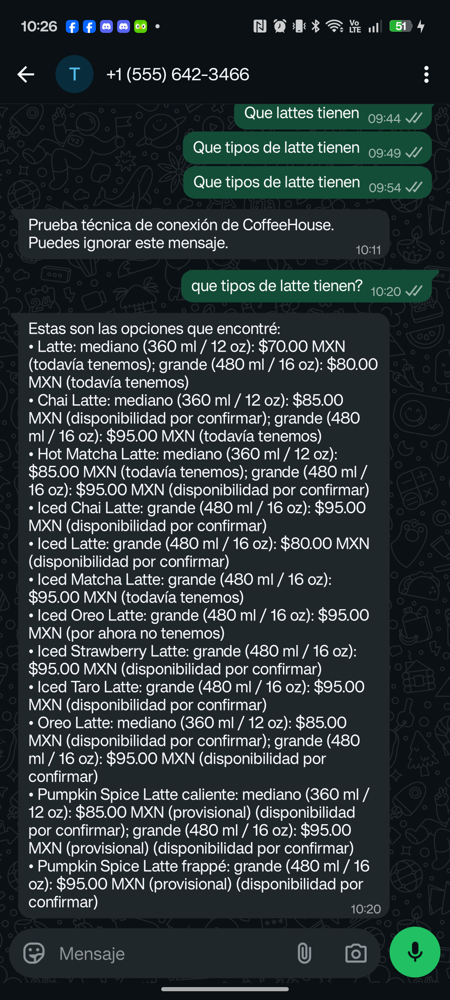

# Integración sintética final — 9 de octubre de 2026

## Entorno comprobado

- Backend Hackathon 2 en VPS Debian 12, detrás de la ruta HTTPS exclusiva del proyecto y escuchando en loopback.
- Qwen3Guard `Qwen/Qwen3Guard-Gen-0.6B` en la torre Debian 13, snapshot `fada3b2f655b89601929198343c94cd2f64d93cc`, conectado al VPS por un túnel SSH restringido a direcciones de loopback.
- Groq configurado para la demostración. La cuenta y el número de WhatsApp de Meta son de prueba; la app Mozart está suscrita a `messages` y su callback corresponde a Hackathon 2.
- Se usó una base SQLite temporal y datos sintéticos. No se contactó la API de WhatsApp ni se envió ningún mensaje durante esta batería.

## Recorridos y resultado

| Caso | Resultado | Tiempo observado |
| --- | --- | ---: |
| Pregunta por latte | Aclaración ante modalidad no especificada | 21.948 s |
| Consulta coloquial con erratas sobre Oreo | Pidió aclaración | 14.122 s |
| Latte caliente con leche de avena | Respondió con existencia y total | 14.600 s |
| Pregunta por horario no confirmado | Reconoció que falta información | 13.907 s |
| Intento de inyección de instrucciones | Pausó el flujo | 5.862 s |

Resultado: **5/5 casos pasaron**. La mediana fue 14.122 segundos y el rango, 5.862–21.948 segundos. Son cinco observaciones sintéticas de desarrollo; no prometen rendimiento para tráfico real.

## Otras comprobaciones

- Qwen3Guard local respondió `Safe` a una consulta normal y `Controversial` a un intento sintético de inyección.
- El servicio H2 recibió una clasificación a través del túnel privado y se pausó con seguridad si la guardia no podía validar.
- Meta confirmó la app Mozart, el campo `messages` y la callback dedicada de H2.
- Suite H2+T1: **109 aprobadas, 2 omitidas** por requerir Tesseract.
- Hackathon 1 mantuvo su ruta y respondió HTTP 200 durante la revisión del VPS.

## Qué falta

La lista «A» de Meta ya contiene el teléfono receptor en el formato `52` + número nacional. El webhook entrega móviles mexicanos como `521` + número nacional. Una prueba directa al formato mostrado por Meta fue aceptada y luego reportó los estados `sent`, `delivered` y `read`. H2 normaliza este identificador al recibir el webhook para que la conversación, la autorización del personal y la respuesta utilicen el formato actual `+52`; el cambio ya está desplegado y el webhook público pasó el desafío HTTPS. El 9 de octubre, una consulta desde Android preguntó qué tipos de latte hay; el asistente respondió con las opciones del menú y Meta confirmó `sent`, `delivered` y `read`. La consulta tardó aproximadamente 22 segundos en procesarse. Después se envió un pedido de prueba y se recibió un borrador; falta la confirmación explícita del cliente y el ciclo de personal. No usar clientes ni datos reales.

OCR está apagado en el VPS. La prueba sintética no cubre reconocimiento de fotos ni acredita el ciclo real de mensajes entrantes y salientes. No es una validación de producción.

## Intento manual desde el teléfono

El 9 de octubre se conectó un Android de prueba y se abrió el chat del número de prueba de Meta. La primera consulta llegó al webhook y el trabajo del asistente terminó, pero Meta rechazó la respuesta con HTTP 401; la comprobación privada devolvió error 190/subcódigo 463. El token se renovó después y las consultas Graph confirmaron el recurso telefónico y el permiso `whatsapp_business_messaging`. Dos consultas posteriores llegaron al webhook y se completaron, pero Meta rechazó las respuestas con HTTP 400/código `131030`. No se recibió respuesta del asistente, no se creó ningún pedido ni se afectó el inventario. La lista «A» ya mostraba el destinatario permitido. La revisión privada encontró una diferencia de formato: el webhook dio `521...` y la lista de Meta usa `52...`. Un envío directo de comprobación al formato de la lista fue aceptado con HTTP 200 y sus estados posteriores confirmaron `sent`, `delivered` y `read`. H2 normalizó el identificador al entrar y el cambio se desplegó. No se incluye captura porque la pantalla contiene mensajes previos y elementos ajenos a la evidencia.

**Actualización posterior, 9 de octubre:** se envió desde Android la consulta «¿qué tipos de latte tienen?». El webhook la recibió, el asistente respondió con las opciones del menú y Meta confirmó que la respuesta fue enviada, entregada y leída. El pedido de demostración y su aceptación por personal siguen pendientes.

## Pedido de prueba: borrador pendiente

El 9 de octubre, el teléfono de prueba envió: «Quiero un latte caliente mediano con leche de avena». El agente respondió con un resumen de 1 Latte mediano, extra Leche de Avena y total de **$85.00 MXN**. La propuesta quedó en la conversación como un borrador con vencimiento; no se creó un pedido ni hubo movimientos de inventario. La consulta y la respuesta quedaron registradas como completadas, y Meta marcó la respuesta como leída.

La base confirmó que el borrador apunta a `hot_latte`, tamaño mediano, cantidad 1 y modificador `leche_avena`; el precio base es $70 y el extra $15. Aunque el borrador identifica la variante caliente, su texto visible no repite la palabra «caliente»; esto se revisará antes de confirmar. La aceptación del cliente, el aviso al personal y el descuento tras aceptación aún no se han probado.

La respuesta automática a la consulta anterior sobre el menú también quedó registrada como `read` por Meta:

